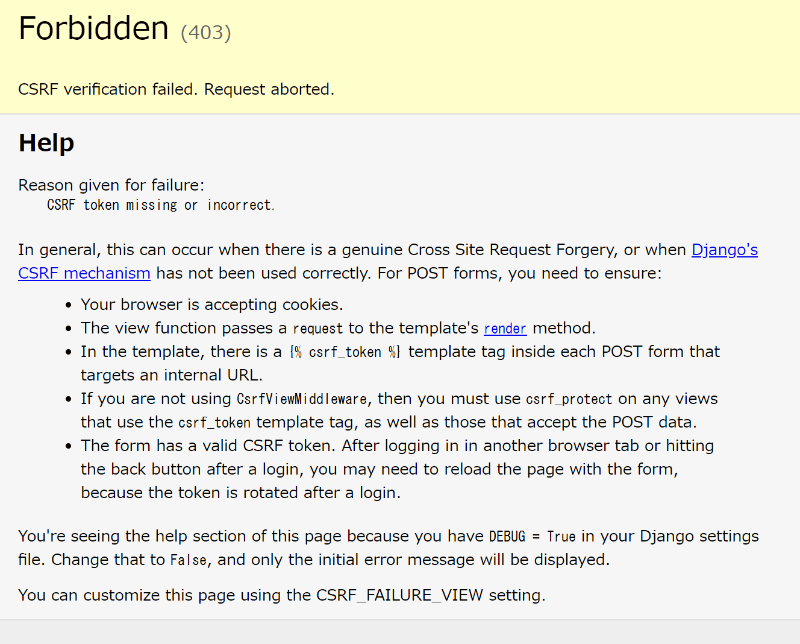

前回 データベースの構築を行ったのでいよいよ本格的にブログの機能を作っていきます。  
今回は、ブログ記事の投稿ページを作ろうと思います。  

### シリーズ一覧  
> 1. [プロジェクトの作成とアプリケーションの作成](/articles/68/)  
> 1. [view関数の書き方](/articles/69/)  
> 1. [URLの指定の仕方(URLディスパッチャ)](/articles/70/)  
> 1. [データベース(モデル)の設定](/articles/71/)  
> 1. [記事の投稿ページの作成](/articles/72/) <- 今回  
> 1. [記事の一覧ページと詳細ページの追加](/articles/73/)  
> 1. [記事の編集ページと記事の削除機能の追加](/articles/74/)  
> 1. [いいね機能の追加](/articles/75/)
> 1. [コメント機能の追加](/articles/77/)
> 1. [Bootstrapを利用したwebデザイン](/articles/78/)


## はじめに
前回までにデータベースの設定までを済ませているていで話しを進めるのでそのつもりでお願いします。  


## 記事の投稿機能をつくる
### HTMLファイルの作成
ウェブサイトからサーバーにデータを送信するには、フォームが必要なのでHTMLファイル内に投稿用のフォームを作ります。  
以前作成したnew.htmlの内容を書き換えて以下のようにしておきましょう。  
```html
<!DOCTYPE html>
<html>

<head>
  <meta charset="utf-8" />
  <title>my-blog-new</title>
  <meta name="viewport" content="width=device-width, initial-scale=1">
</head>

<body>
  <h3>まい ぶろぐ 新規記事の投稿ページ</h3>
  <form action="" method="post">
    <p><label for="title_input">記事のタイトル</label></p>
    <p><input type="text" name="title" id="title_input"></p>
    <p><label for="text_area">記事の本文</label></p>
    <p><textarea name="text" id="text_area" cols="30" rows="10"></textarea></p>
    <p><button type="submit">投稿</button></p>
  </form>
</body>

</html>
```

Django側でPOSTされたデータを取り出すのに`name属性`が必要になるので、フォーム内の要素には**必ず指定する**ようにしましょう。  

### サーバー側の設定(views.py)
続きましてサーバー側の設定です。  

このページは、通常通りウェブページを要求された(GETメソッド)ときは、記事を新しく投稿するページを表示させる。  
データを投稿された(POSTメソッド)ときは、データベースにデータを登録する。  
と、挙動を変える必要があります。  

なので`if文`で条件分岐を発生させます。  
条件はhttpアクセスがPOSTメソッドの時です。  

#### httpアクセスのメソッドを調べる  

どうやってメソッドを判別するかですが、new関数の第一引数で受け取る`request`の中にhttpのアクセス情報が入っているのでそこから情報を取り出します。  
具体的には`request.method`の中にどのメソッドによるアクセスかが文字列として入っているのでそれを比較します。  

```py
if request.method == "POST": # もしメソッドがPOSTだったら
    データの登録処理

return render(...)
```

こんな感じですね。  

#### POSTされたデータを取り出す

続いてPOSTされたデータの登録処理ですが  

POSTされたデータってどこに入ってるの？  

これも同じく`request`の中に入っています。  
もう少し詳しく言うと、`request.POST`に辞書型っぽい形で入ってます。  
この時に辞書のキーに相当するのがHTMLファイルで指定した`name属性`の値です。  

例えば、new.htmlでは、記事のタイトルを入力する`<input>`タグには`name="title"`としているので、  
```py
request.POST["title"]
```
とすることで取り出すことができます。  

#### データベースへデータを新規登録する
POSTされたデータは、自動的に保存されるわけではないので、データベースに保存するためのコードを書きます。  

データベースへのデータの新規登録をArticleを例にとって説明します。  
```python
models.Article.objects.create(title="新規データの登録テスト", text="テスト。テスト。")
```
`create`メソッドの引数にそれぞれどのような値を登録するかを名前付き引数で指定します。  

または、以下のようにしてもできます。  

```py
article = models.Article()
article.title = "新規データの登録テスト"
article.text = "テスト。テスト。"
article.save()
```

だだしこちらの場合は、必ず**saveメソッドを呼ばないとデータが保存されない**ので注意です。  

#### 実装
先ほどまでの内容を踏まえて、views.pyを弄ります。  
new関数を改造して以下のようにします。  
```python
from django.shortcuts import render
from . import models

# 略

def new(request):
    template_name = "blog/new.html"
    if request.method == "POST":
        models.Article.objects.create(title=request.POST["title"],text=request.POST["text"])
    return render(request,template_name)
```

先ほど説明した内容をそのままpythonのコードにおこしました。  
`if文`の中でデータベースへの登録処理を行っています。  

### URLの設定
URLに変更はないので前回までに以下の内容が書いてあればOKです。  
```python
from django.urls import path
from . import views

urlpatterns = [
    path("", views.index, name="index"),
    path("new/",views.new, name="new"),
]
```

### 試してみる
Djangoサーバーを有効にします。  
```
python manage.py runserver
```

http://localhost:8000/new

にアクセス  


試しに何か投稿してみましょう。  



おおっと！  
なんかエラーが出るぞ！！  


実はDjangoにはデフォルトでcsrf攻撃に対する対策が有効になっていて、ただPOSTするだけじゃダメなんです。  

じゃあどうすんの？  

フォームの部分に``を書き足します。  
```html
  <form action="" method="post">
    
    <p><label for="title_input">記事のタイトル</label></p>
    <p><input type="text" name="title" id="title_input"></p>
    <p><label for="text_area">記事の本文</label></p>
    <p><textarea name="text" id="text_area" cols="30" rows="10"></textarea></p>
    <p><button type="submit">投稿</button></p>
  </form>
```
なんじゃそれと思うかもしれませんが、今はおまじない程度に思っておいてください。

さて、改めてもう一度  

何かしら投稿したら、きちんとデータが登録されたか確認してみましょう。  
```
python manage.py shell
```
上記のコマンドを実行するとpythonのシェルが起動するので以下のプログラムを実行して下さい。  
```python
from blog import models # blogの部分は自分で設定したアプリケーション名に置き換えてください

models.Article.objects.all()
```

```
<QuerySet [<Article: 記事の投稿テスト>]>
```
おそらくこんな感じの出力になるはずです。  
自分で投稿した記事のタイトルが表示されていれば大丈夫です。  

確認が終わったら、
```py
exit()
```
でシェルから抜けられます。  

## まとめ
httpアクセスのメソッドは`request.method`で取得できる。  

`form`内のタグには必ず`name属性`を与える。  
POSTされたデータは`request.POST`に入っている。  

データベースに新しくデータを追加するときは  
```py
Model.objects.create(title="タイトル",text="本文"),
```

### 最後に
今回は記事の投稿ページを作りました。  
が、これだとまだウェブページ上で投稿したデータが見られません。  
なので、次回に記事の一覧ページと記事ごとの閲覧ページを作成してみましょう！  

次回  
> [[Django] 記事の一覧ページと詳細ページの追加](/articles/73/)  
